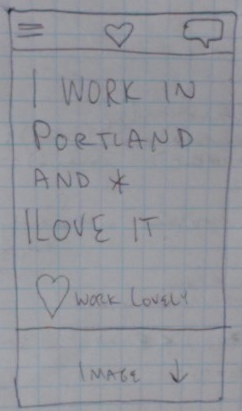
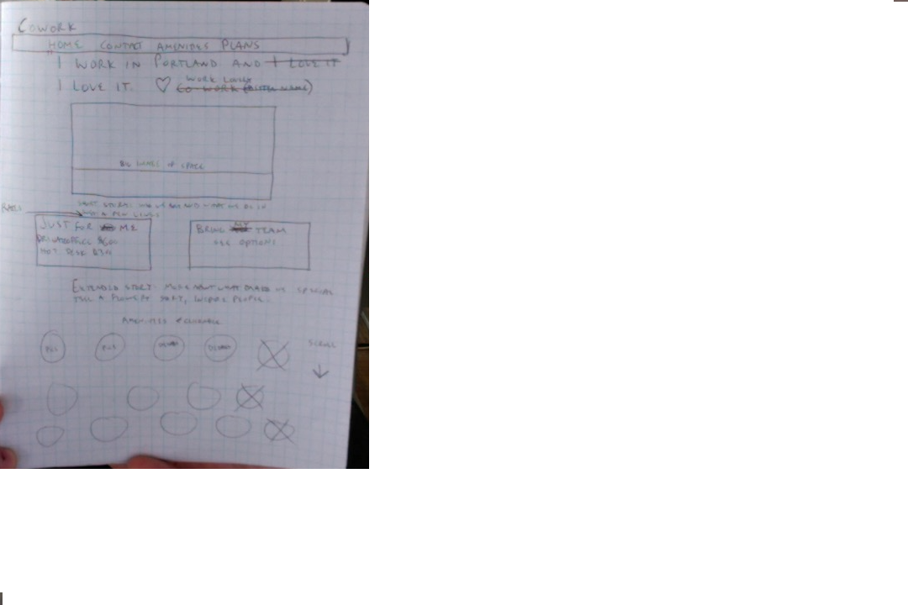
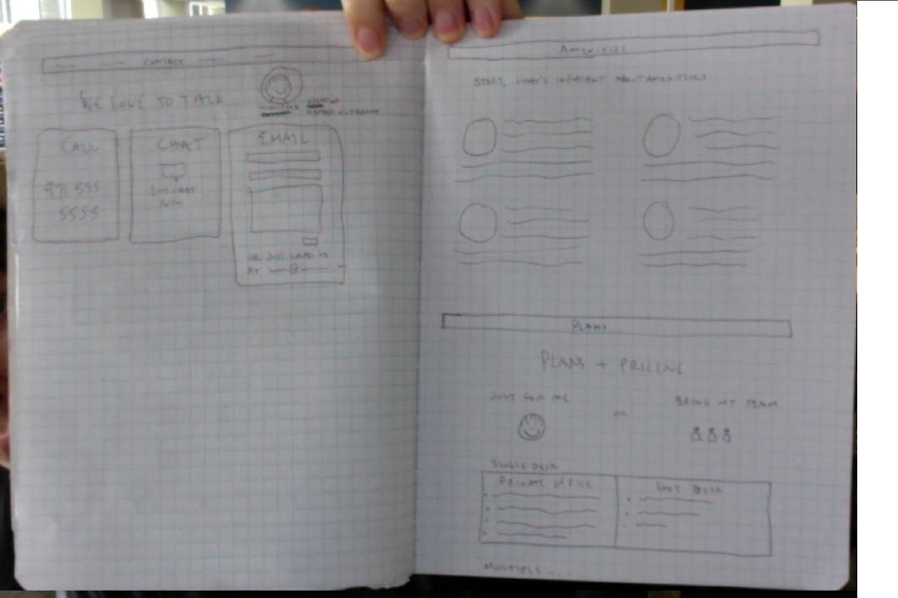
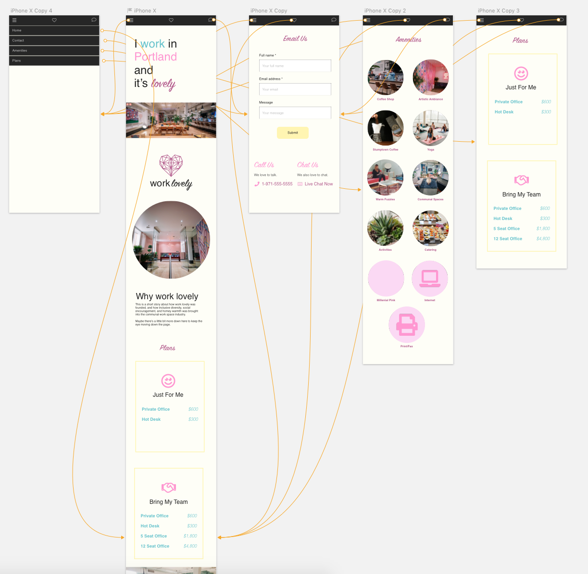
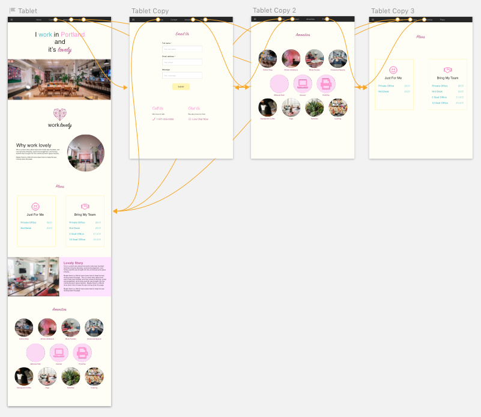
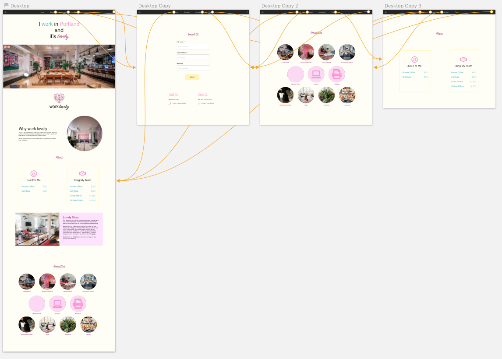

# [CoWork](https://michaelmeow.github.io/cowork)

#### A coworking startup page, 8/24/18

#### By Michael Meow

## Description

This website was built for CoWork, a new startup in Portland leasing shared office space.  Visitors to the site will want to know what types of space are available and at what cost, what amenities are available, and what the space looks and feels like.  They will also want to know the story of the company and why they should choose to lease a space or a desk.

## User Stories

The frugal:  “I just want to see the price, I need one of these places, I know they’re all nice, I just want to know what I’ll be paying and what I’ll get for it, if I can’t find that quick I’ll assume it’s expensive and they’re hiding the price.”
-quick nav bar to rates with a decent sized chart displaying price without more clicking as if it’s hidden.

The aesthetic:  “I want to work in the space that feels the best.  Show me pictures of the space, big and up front, so I can imagine what it’s like to be there.”
-big, beautiful pictures in a slideshow.

The sap: “ I want to know this is a welcoming place.  I don’t want to find myself in a place people just go to put on headphones and shut off.  I want to mingle, and I want to be accepted in my diversity.”
-discuss community as a story on first thing you read.

The eager: “I want to sign up, I heard about this place and I already know I want in.  Where do I sign up?”
-quick nav to request a space or viewing.  Also easy contact.

The skeptic:  “This costs a lot, convince me it’s really worth my investment.”
-detailed look at amenities and benefits

The Snob:  “Is this place high-end?  How do I know I’ll be getting good coffee, and that the people around me also appreciate and value nice things?”
-in amenities use specific language to talk up the details.

## Research, Inspire, Brainstorm

From above I learned:  
-quick nav bar to rates with a decent sized chart displaying price without more clicking as if it’s hidden.
-big, beautiful pictures in a slideshow.
-discuss community as a story on first thing you read.
-quick nav to request a space or viewing.  Also easy contact.
-detailed look at amenities and benefits
-in amenities use specific language to talk up the details, mention coffee brand served at coffee bar.

Example sites: WeWork.com, TechSpace.com
WeWork.com is ideal.  Quick price grabber.  Big pictures.  Big map.  Nice transition from price into what do you get for it.  Perfection.  

Techspace.com feels lame, cold.  Wework situates itself in the right city for you right away, when in tech space and the location is anywhere, it feels like you’re in an airport or something, it’s alienating.  The location should be a big part of our story and the feel of our site.  Use images with people in them so you can say, those are my people.

Name brainstorm:
WorkHearth
WorkLovely

Catch Phrase:
“Love where you work.”
“I work in Portland and I love it.”

## Sketches

## Screenshots

## Setup/Installation Requirements

* On GitHub, navigate to the main page of the repository.
* Under the repository name, click Clone or download.
* In the Clone with HTTPs section, click  to copy the clone URL for the repository.
* Open Terminal.
* Change the current working directory to the location where you want the cloned directory to be made.
* Type git clone, and then paste the URL you copied in Step 2.
* Press Enter. Your local clone will be created.
* Use a browser to open index.html.

Or, simply click the link at the top of the README to be redirected to the site on gh-pages.

## Known Bugs

There are no known bugs.

## Support and contact details

Please contact dearmichaelmeow@gmail.com with questions or comments.

## Technologies Used

This page uses Bootstrap CSS along with HTML and CSS.  It uses JS and JQuery.

### License

This site is licensed as CDL.

Copyright (c) 2018 Michael Meow
